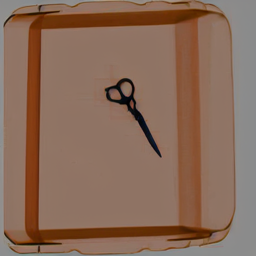

# Lora 모델 만들기 (X-ray 가위사진 생성하기)

## 참고자료
[https://github.com/bmaltais/kohya_ss](https://github.com/bmaltais/kohya_ss)

## 이미지 비교

### 30장 학습시킨 결과

30장의 데이터를 사용하여 학습시킨 Lora 모델로 생성한 이미지들입니다.

### 150장 학습시킨 결과

150장의 데이터를 사용하여 학습시킨 Lora 모델로 생성한 이미지들입니다.

## 비교

- **30장 학습**: 적은 데이터로 인해 생성된 이미지의 디테일과 정확도가 낮을 수 있습니다. 학습 데이터가 부족할 경우 모델이 일반화되지 않고 특정 패턴에 과적합될 수 있습니다.
- **150장 학습**: 더 많은 데이터를 사용하여 학습한 경우, 모델의 성능이 향상되고 생성된 이미지의 디테일과 정확도가 높아집니다. 모델이 더 일반화되고 다양한 상황에서 잘 동작할 가능성이 큽니다.

데이터 수가 늘어날수록 모델의 성능이 어떻게 향상되는지 확인할 수 있습니다. 이를 통해 Lora 모델을 훈련할 때 충분한 데이터를 확보하는 것이 중요함을 알 수 있습니다.
